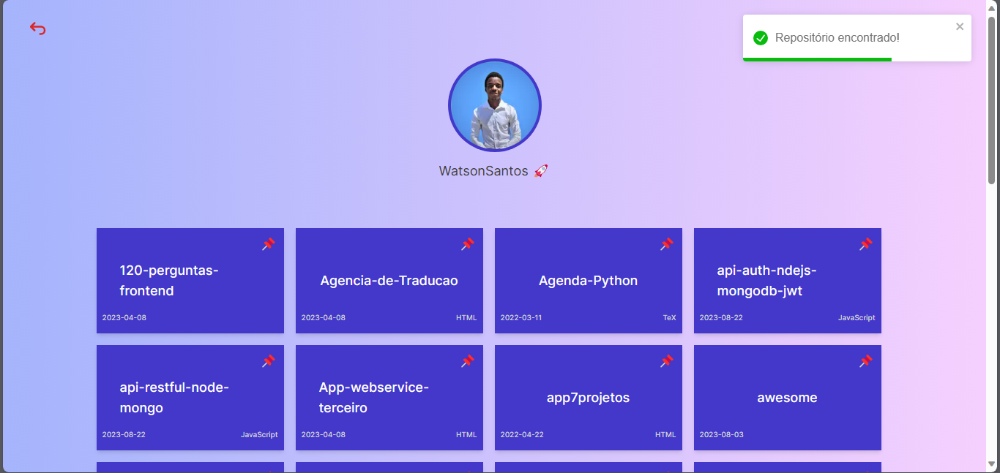

<br>
<p align="center">
 
 
 <a href="https://github.com/WatsonSantos/mi-repos/commits/master" target="_blank" >
      </a>
 
 <a href="https://github.com/WatsonSantos/mi-repos/stargazers" target="_blank">
      </a>
 <a href="www.linkedin.com/in/watson-dos-santos-a1b547182/" target="_blank">
      </a>
 <a href="https://www.instagram.com/watson_santos1/" target="_blank">
       </a>

</p>

<div align=center>
  
</div>

## 💻 Sobre o projeto

<p align="center">🚀 Uma aplicação web/site para listar os reposotórios do GitHub de qualquer utilizador que tenha conta no na plataforma GitHub.</p>

<br>

<p align="center">
 <a href="#-sobre-o-projeto">Sobre</a> •
 <a href="#-funcionalidades">Funcionalidades</a> •
 <a href="#-demonstração">Demonstração</a> • 
 <a href="#-pré-requisitos">Pré-requisitos</a> • 
 <a href="#-executando-a-aplicação">Executando a aplicação</a> • 
 <a href="#-tecnologias">Tecnologias</a> • 
 <a href="#-autor">Autor</a> • 
 <a href="#-licença">Licença</a>
</p>
<br>
<h4 align="center"> 
	🚩   Status:  Em construção...🚀   🚩
</h4>

## ⚙️ Funcionalidades

- ✅ Pesquisa de Uitilizador do Github
- ✅ Listagem dos Repositórios
  - Avatar da conta no GitHub
  - Nome do repositório
  - Linguagem Utilizada
  - Data de criação
- ✅ Botão de retrcoceder á página inicial
- ✅ Mensagem de sucesso
- ✅ Mensagem de erro
- ❌ Vizualização de cada repositório em particular
  - Nome do reposiório
  - Descrição
  - Likes
  - Commits
  - Ligunagnes
  - Size
  - e mais...

## 📺 Demonstração

<br>


<br>

 <a href="https://vercel.org" target="_blank"> 
  
 </a>

Link para teste: [Mi-repos](https://mi-repos.vercel.app/)

<br>

## 🔗 Pré-requisitos

Antes de começar, você vai precisar ter instalado em sua máquina o [Node.js](https://nodejs.org/).
<br>
Além disto é bom ter um editor para trabalhar com o código como [VSCode](https://code.visualstudio.com/)

## 🎲 Executando a aplicação

```bash
# Clone este repositório
$ git clone <https://github.com/WatsonSantos/mi-repos>

# Acesse a pasta do projeto no terminal/cmd
$ cd mi-repos

# Instale as dependências
$ npm install

# Execute a aplicação em modo de desenvolvimento
$ npm run dev

# O servidor inciará na porta:3000 - acesse <http://localhost:3000>
```

## 🛠 Tecnologias

As seguintes ferramentas foram usadas na construção do projeto:

- [Node.js](https://nodejs.org/)
- [Next.js](https://nextjs.org/)
- [javaScript](https://www.javascript.com/)

## 👨‍💻 Autor

<a href="https://github.com/WatsonSantos">
 
 <br />
 <sub><b>Watson Santos</b></sub></a> <a href="https://github.com/WatsonSantos" title="Watson Github">🚀</a>

Feito com ❤️ por Watson Santos 👋🏽 Entre em contato!

[](https://www.linkedin.com/in/watson-dos-santos-a1b547182/)
[](mailto:watsontavares72@gmail.com)

## 📝 Licença

Este projeto esta sobe a licença [MIT](./LICENSE).
